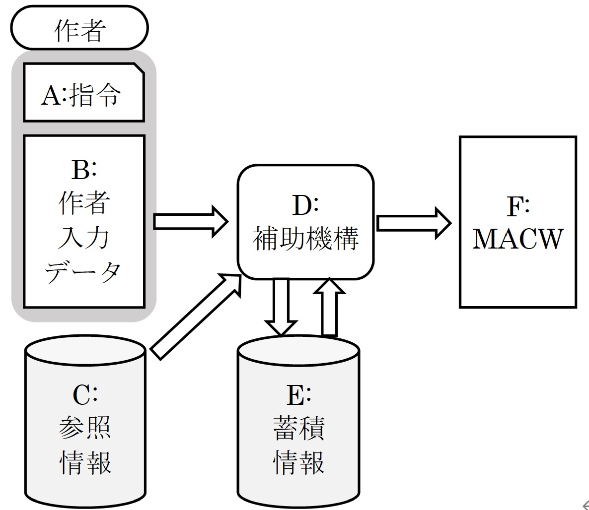
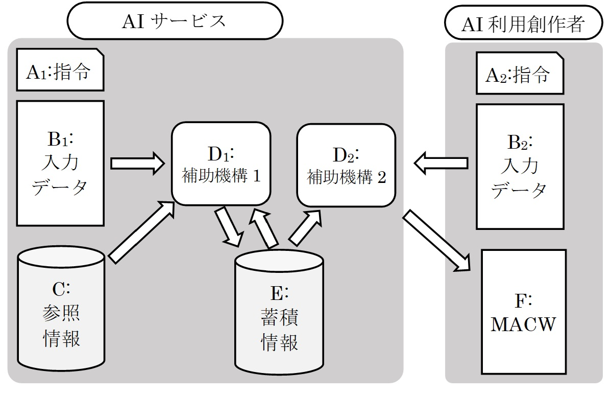
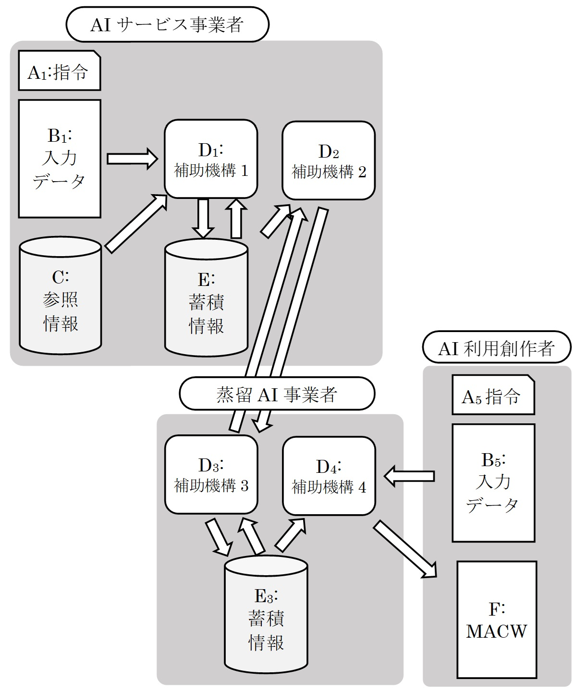
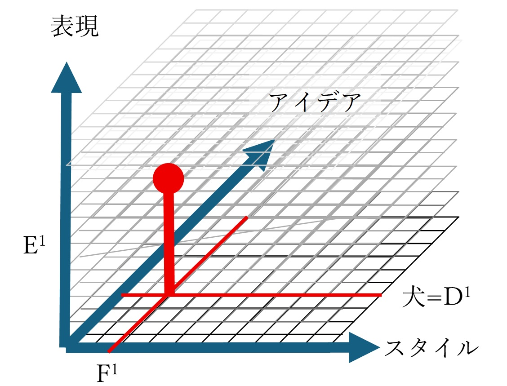
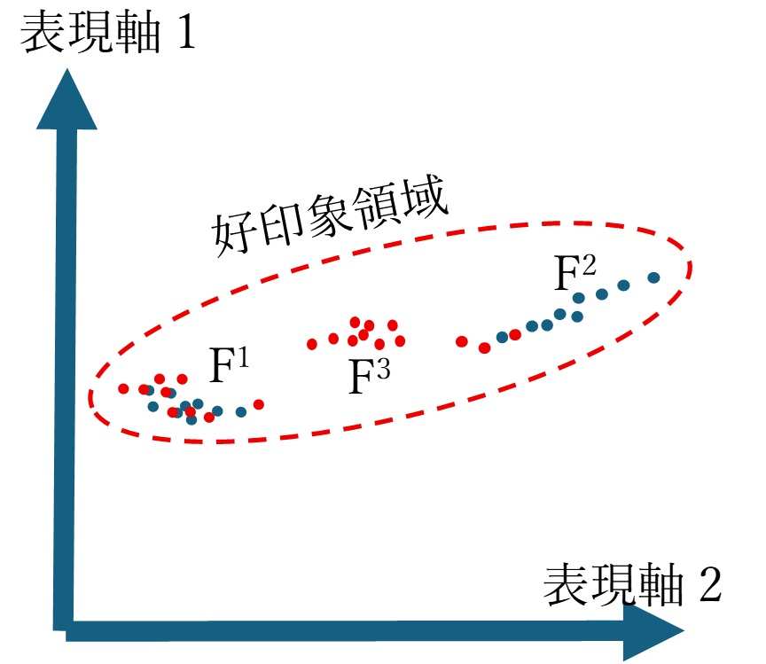
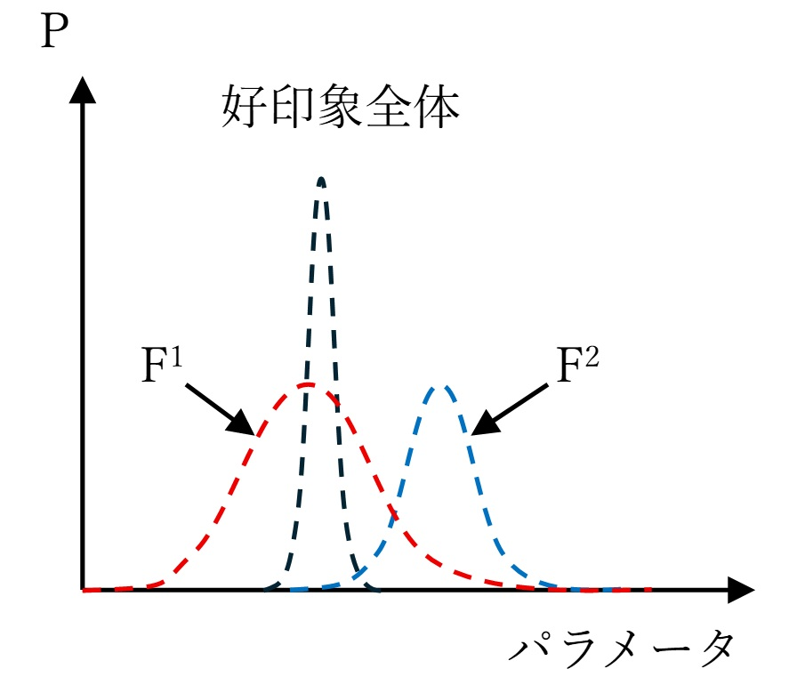

# AIとスタイルの知的財産

AIによるスタイルの分析と再現が実用的に行えるようになってきた。
スタイルは著作権法上は「ほぼ」保護の対象ではない。
AIによるスタイルの再利用はどのような影響をもたらすか。
AIの利用とスタイルを創作するインセンティブのバランスはどうとるべきか。

## そもそも知的財産とはなにか?

- 自然権ではなく、インセンティブである。
- 創作、発明、ビジネス開発をする人のインセンティブを保持し、健全な競争を促す。
- いろいろ問題はあるが、とりあえずうまく回っている。変えるとよくなるかはわからない。
- ものすごく問題である場合だけ、改正している。

## LLMによって可能になったこと

- スタイルを分析、再生可能になってきた
- スタイルには著作権は「ほぼ」ない

## スタイルに著作権がない理由

- 歴史的にスタイルは再利用されてきた
  べらぼう、ではつたや重三郎が歌麿に別の絵師の模倣作品を作成させる
  絵画、音楽、小節などでスタイルの模倣は常に行われてきた

## スタイルに価値がないとされているわけではない

- 模写や模倣は否定されるわけではないが、オリジナルほどは評価されない
  水玉模様の元祖と模倣では作品価値は最低でも100倍以上異なる
- 商標は使えないので分かる人には二流とされ、わからない人にはそもそもわからないから模倣するメリットがない
- スタイルは商標と一部重なる価値をもって商品流通を高率化し付加価値を高める

## スタイルの保護

- 著作権法第30条の4
- 利用許諾条件による制限

スタイルの無断利用で利益が損なわれる例。いらすと屋AI
第3者を経由したスタイルの利用 - 音楽生成AIサービス

XX風アニメの生成は30条4の例外になるだろうか？

### 推進側の矛盾

- XX風アニメが利益をもたらすならば、たとえ原著作者がそのビジネスを行っていなくても、行って利益を得ることが可能と推測される。
- xx風アニメが利益をもたらさいなら、使う人がいない。

### 契約による保護の弊害

前著作権法時代の弊害がすべて再現する。
スタイルに価値があるコンテンツはすべて契約の上配信、提供されるようになる。

## AIによるスタイルの分析と再現

現在AIと呼ばれているものは基本的には学習器と合成器からなる応用ソフトウエアです。

- D:補助機構に様々な新しいアルゴリズムが提案
- C:参照情報としてはexampleとしての作品例
- E: 蓄積情報としては参照情報に含まれる統計情報

- A: 指令としてはプロンプトなどで指示を与える
- B: 元画像を与える場合もある

D: の補助機構の性能が劇的に向上し、蓄積情報と指令から非常に高品質の画像、動画、テキストを生成できる。

サービス会社が独立し、利用者はすでに分析された統計情報を用いて、指令と入力データを与えて出力を得て利用する。

蒸留手法を使うと出力から統計情報を抽出可能。
多くのAIサービス企業はこの方法による統計情報の抽出を禁止している。
つまり出力には「価値ある」統計情報が含まれることを認めている。

## AIによるスタイル再現のモデル

コンテンツの生成は、アイデアにスタイルを与え、さらに表現を特定することで、特定の作品が生成されるというようにモデルかして考える。

同じスタイルに対し異なるアイデアの作品を多数つくることができる。また同じアイデア、スタイルに対して様々な表現が存在する。

優れたスタイルは、好印象の作品の一部を占める。価値ある作品は稀であるが無限に存在する。価値あるスタイルも無限に存在する。

AIMLが、既存のスタイルを分析して再現するだけなのか、新たなスタイルを生み出す能力があるのかはわからない。

- 